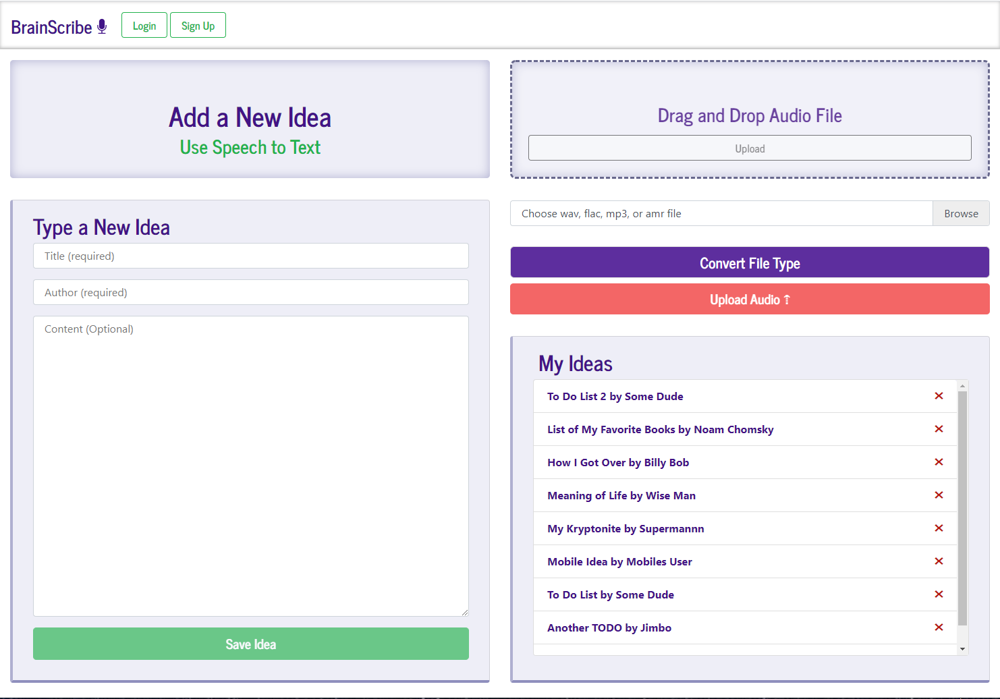
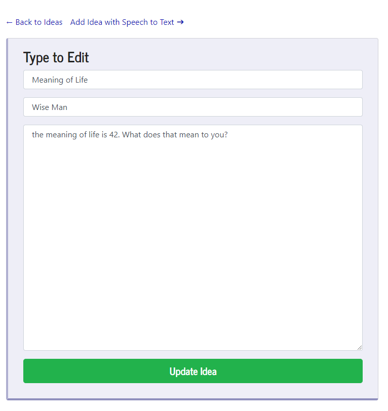
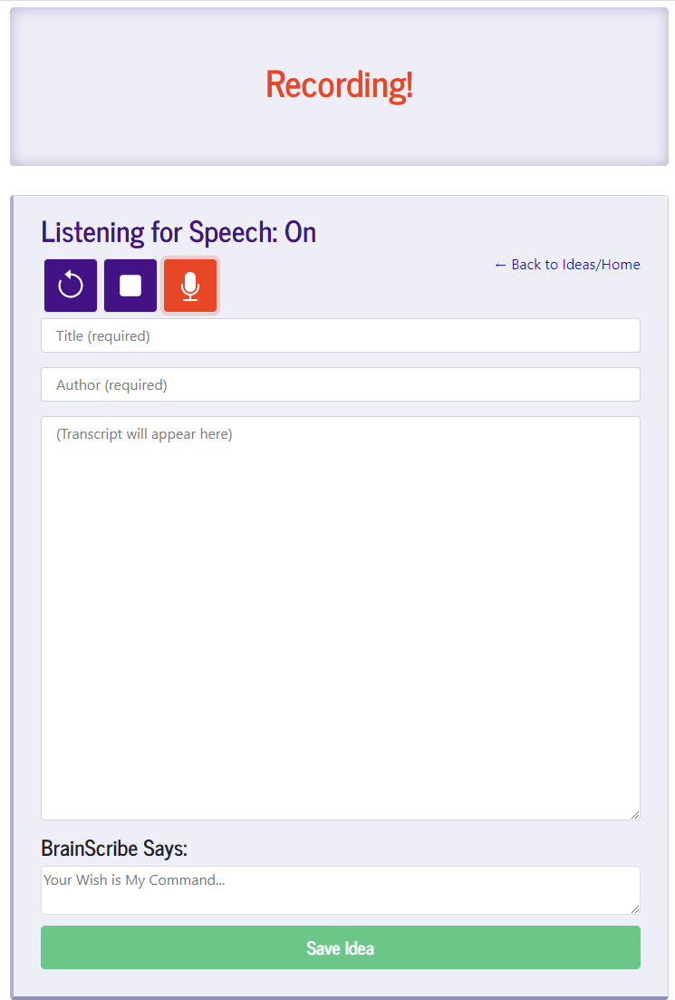

# BrainScribe
Save and organize ideas verbally with Speech-to-Text and React

# My Web Development Portfolio 

## Description

For this project, I built and deployed a Full Stack Application to Heroku and Github Pages with the MERN Stack: `MongoDB, Express.js, React.js, Node.js`. I also use both the Google Cloud Speech API and the Web Speech API (limited mainly to Chrome browser) for multiple avenues of speech recognition/transcription. 

The project is deployed at this link: (https://brain-scribe.herokuapp.com/ideas)

The Github Repo/code can be viewed here: (https://github.com/gregriss/brain-scribe)  

## Table of Contents  

- [Usage](#Usage)  
- [Tech Used](#Tech)
- [License](#License)  
- [Questions](#Questions)

## Usage

This app lets you document your ideas in many ways. My hope is that it is simple and clear to use.   

### Homepage
On the homepage, you have options to type and save an idea, drag and drop an audio file (wav, flac, mp3, or amr format only) into the Drop zone, or manually Browse and select a file to upload. From there, the app will save your idea to a database, and you can access the ideas in the My Ideas list. 

### Ideas/Updating
Click on an idea, and you'll be taken to a page where you can view the content of that idea and make updates as you wish. Be advised that if you want to update the idea, you must make an edit in each of the three form fields for the Idea to update correctly. The React app monitors the state of the form fields and then re-saves the Idea to the database upon submission.

  

### Speech to Text/Streaming Text Recognition  

On the Speech to Text page (if using Chrome or Edge browsers), you have the ability to click record, and speak into a microphone (after giving mic access to your browser). You can give commands such as `title is ...` and `author is ...` to set those fields on the page. Say `stop` to stop recording. You can also say `reset` to clear the Content Field and start your idea again. Try saying `save this idea` and the App will stop the micriphone and save the idea to the database. Additionally, the software allows users to save Ideas to the database using the command `save this idea`, or just `save`. Also try saying `open ` followed by the name of any website, such as Google or Facebook, and BrainScribe will open that page in a separate tab for you! 

# Tech  

This App was built with MongoDB/Cloud Atlas, Express.js server, React.js, and Node.js. I also used Boostrap and SASS, as well as the Google Cloud Speech API, the Web Speech API/React Speech Recognition package, the HTML Drag and Drop API, and the Express File Upload package.  

## License

Copyright (c) [2021] [Greg Riss]

Permission is hereby granted, free of charge, to any person obtaining a copy
of this software and associated documentation files (the "Software"), to deal
in the Software without restriction, including without limitation the rights
to use, copy, modify, merge, publish, distribute, sublicense, and/or sell
copies of the Software, and to permit persons to whom the Software is
furnished to do so, subject to the following conditions:

The above copyright notice and this permission notice shall be included in all
copies or substantial portions of the Software.

THE SOFTWARE IS PROVIDED "AS IS", WITHOUT WARRANTY OF ANY KIND, EXPRESS OR
IMPLIED, INCLUDING BUT NOT LIMITED TO THE WARRANTIES OF MERCHANTABILITY,
FITNESS FOR A PARTICULAR PURPOSE AND NONINFRINGEMENT. IN NO EVENT SHALL THE
AUTHORS OR COPYRIGHT HOLDERS BE LIABLE FOR ANY CLAIM, DAMAGES OR OTHER
LIABILITY, WHETHER IN AN ACTION OF CONTRACT, TORT OR OTHERWISE, ARISING FROM,
OUT OF OR IN CONNECTION WITH THE SOFTWARE OR THE USE OR OTHER DEALINGS IN THE SOFTWARE.  

## Questions  

Greg's Gitub Profile: https://github.com/gregriss  

If you have any questions about me, my work, or my portfolio, you can reach me at [gregriss23@gmail.com](mailto:gregriss23@gmail.com)
